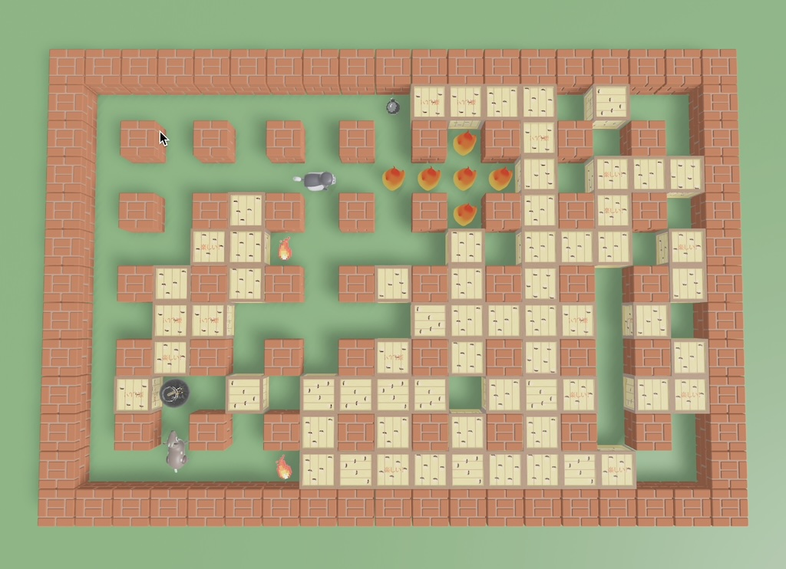

# Killer-Critters

A simple and fun multiplayer mega bomberman inspired game written in Rust using the Bevy game engine. The game has been tested on desktop and the web (via WASM).

Play it at [stevenlovegrove.github.io/killer-critters](https://stevenlovegrove.github.io/killer-critters/)!

**Player 1 Controls:** Arrow keys + Space

**Player 2 controls:** WASD + Q

3 + 4 players is supported via bluetooth controllers but requires a one-line code change in main.rs:148.



## Build and Run from Source

##### Install rust

https://www.rust-lang.org/tools/install

TL;DR: Linux/Mac: `curl --proto '=https' --tlsv1.2 -sSf https://sh.rustup.rs | sh`

##### Checkout project

```
cd ~/your_code_dir
git clone https://github.com/stevenlovegrove/killer-critters.git
cd killer-critters
```

##### Run natively on desktop

`cargo run --release -- --fullscreen`

*Note: Bevy has performance issues in a non-optimized build, so don't forget that --release flag*

##### Deploy on the web

###### Do once

Install the rust wasm toolchain and optionally a simple local webserver:

```bash
rustup target add wasm32-unknown-unknown
cargo install wasm-server-runner # optional
```

To make working with wasm targets simpler, ask cargo to automatically start a local webserver when running them. Just add to your *~/.cargo/config.toml*

```toml
[target.wasm32-unknown-unknown]
runner = "wasm-server-runner"
```

###### Running

If you setup the default runner as above, just execute:

````bash
cargo run --target wasm32-unknown-unknown --release
````

which will start the server and provide a URL for viewing.


###### Embed on webpage

```bash
cargo build --release --target wasm32-unknown-unknown
wasm-bindgen --no-typescript --target web \
    --out-dir ./web-dist/ \
    --out-name "killer-critters" \
    ./target/wasm32-unknown-unknown/release/killer-critters.wasm
```

The generated wasm file is a bit large. It takes a minute or so, but you can make it smaller with

```bash
wasm-opt -Oz -o ./web-dist/killer-critters_bg.wasm ./web-dist/killer-critters_bg.wasm
```

Now the wasm can be embedded on your page - see [github.com/stevenlovegrove/killer-critters/tree/gh-pages](https://github.com/stevenlovegrove/killer-critters/tree/gh-pages) for an example. Note, CORRS prohibits running the webpage by opening the index.html file locally - you'll need to use a web server of your choice. I like to use the simple rust web server 'miniserve':

```bash
cargo install --locked miniserve
miniserve . --open
```


### Contributions

This was a fun weekend project and is released as open-source in case it happens to be interesting to anyone. Issues and Pull requests are welcome, but my replies will be slow, perhaps non-existent.


### A big thanks to the asset creators!

The assets for this game are all made available for free by their authors.

###### 3D Model Assets

* Animal Players: https://www.omabuarts.com/product/quirky-series-free-animals/
  Amazing models! We use the free samples containing a very permissive licence (see website)
* "Sanrio Crates" (https://skfb.ly/6WUyS) by Sophie is licensed under Creative Commons Attribution (http://creativecommons.org/licenses/by/4.0/).
* "Sci- Fi Crate" (https://skfb.ly/6tuwF) by Gilded 8 is licensed under Creative Commons Attribution (http://creativecommons.org/licenses/by/4.0/).
* Fire (https://skfb.ly/6V9OK) by Edgar_koh is licensed under Creative Commons Attribution (http://creativecommons.org/licenses/by/4.0/).

###### Audio Assets

* "Vicious" Kevin MacLeod (incompetech.com)
  Licensed under Creative Commons: By Attribution 4.0 License
  http://creativecommons.org/licenses/by/4.0/
* Explosion sound - [Pixabay Sound Effects](https://pixabay.com/sound-effects/?utm_source=link-attribution&utm_campaign=music&utm_content=6761)
